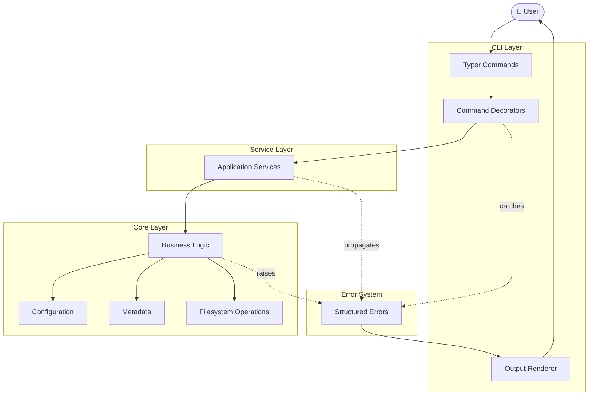
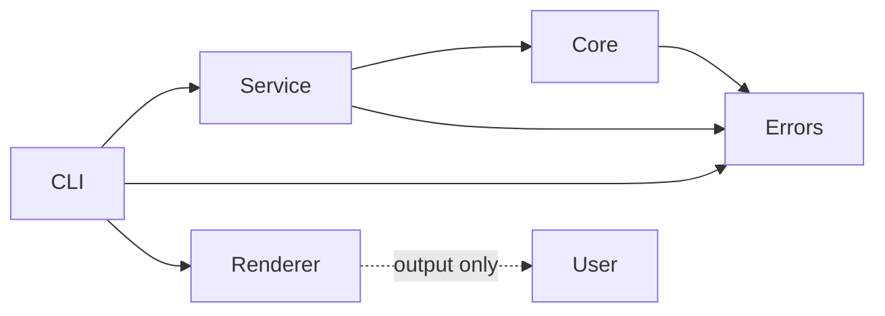
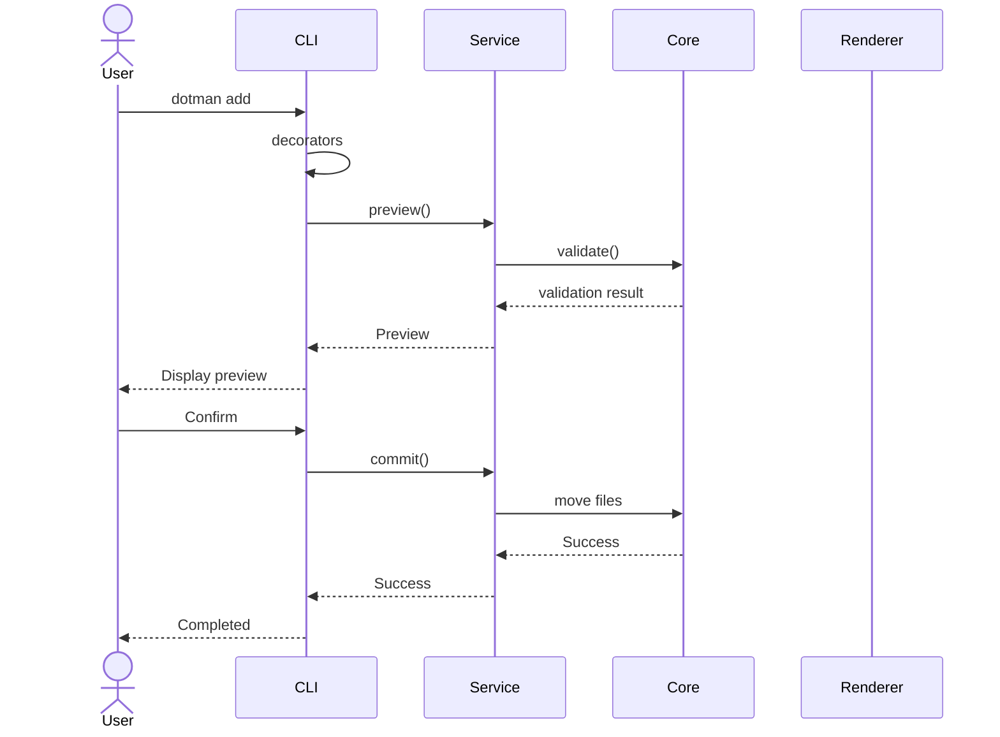

# Architecture

Dotman follows a layered architecture that separates user interaction,
workflow orchestration, and business logic.

The primary goals are:

- Keep business logic independent of the CLI.
- Make commands easy to test.
- Centralize error handling.
- Allow future extension through new commands, renderers, and plugins.

---

# Architecture Overview



---

# Layer Responsibilities

| Layer | Responsibility |
|---------|---------------|
| CLI | Parse arguments, interact with the user, invoke services |
| Service | Coordinate multiple core components into one workflow |
| Core | Business rules and filesystem operations |
| Error | Strongly typed domain errors |
| Renderer | Convert errors into Rich, Plain or JSON output |

---

# Dependency Rules

Dotman intentionally enforces one-way dependencies.



Rules:

- Core never imports CLI.
- Services never perform terminal rendering.
- CLI never implements business logic.
- Renderers are presentation only.
- Errors travel upward through the layers.

---

# Request Lifecycle

The following sequence illustrates the execution of:

```bash
dotman add ~/.zshrc --package shell
```



---

# Core Modules

| Module | Responsibility |
|---------|----------------|
| add.py | Import files into the dotfiles repository |
| linker.py | Create and restore symbolic links |
| profile.py | Profile creation and management |
| doctor.py | Validate repository health |
| config.py | Load and validate configuration |
| get_internal_data.py | Manage metadata |

---

# Service Modules

Services orchestrate multiple core modules.

| Service | Uses |
|-----------|------|
| AddService | add.py |
| ProfileService | profile.py + linker.py |
| SyncService | linker.py |
| DoctorService | doctor.py |
| InitializerService | config.py |
| RemoveService | pathlib |

---

# Error System

Every domain error inherits from `DotmanError`.

The CLI never formats errors directly.

Instead:

```text
Core
   │
raises
   ▼
DotmanError
   │
caught by
   ▼
handle_errors
   │
uses
   ▼
Renderer
   │
prints
   ▼
User
```

Supported renderers:

- Rich
- Plain
- JSON

This makes it possible to reuse the same business logic in different frontends.

---

# Directory Layout

```text
src/dotman
├── __cli__.py
├── __init__.py
├── cli
│   ├── __init__.py
│   ├── app
│   │   ├── __init__.py
│   │   ├── add.py
│   │   ├── doctor.py
│   │   ├── init.py
│   │   ├── remove.py
│   │   ├── root.py
│   │   └── sync.py
│   ├── common_func.py
│   ├── completion.py
│   ├── config
│   │   ├── __init__.py
│   │   └── root.py
│   ├── profile
│   │   ├── __init__.py
│   │   ├── root.py
│   │   └── use.py
│   ├── renderer
│   │   ├── __init__.py
│   │   ├── base.py
│   │   ├── factory.py
│   │   ├── json.py
│   │   ├── plain.py
│   │   └── rich.py
│   └── tree_builder.py
├── core
│   ├── __init__.py
│   ├── add.py
│   ├── config
│   │   ├── __init__.py
│   │   ├── config.py
│   │   ├── constants.py
│   │   └── types.py
│   ├── doctor.py
│   ├── get_internal_data.py
│   ├── initializer.py
│   ├── linker.py
│   ├── profile.py
│   ├── service
│   │   ├── __init__.py
│   │   ├── add_service.py
│   │   ├── doctor_service.py
│   │   ├── initializer_service.py
│   │   ├── profile_service.py
│   │   ├── remove_service.py
│   │   └── sync_service.py
│   ├── utils
│   │   └── fs.py
│   └── validator.py
└── errors
    ├── __init__.py
    ├── config_errors.py
    ├── custom_errors.py
    ├── dotman_error.py
    ├── initializer_errors.py
    ├── profile_errors.py
    └── validator_errors.py
```

---

# Future Direction

The current architecture intentionally keeps the CLI separate from the core
logic.

This makes future integrations possible without changing the business layer,
including:

- Plugin support
- REST API
- Textual TUI
- GUI frontends
- Additional output renderers