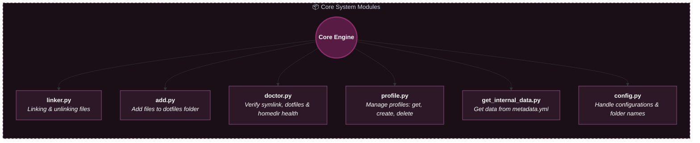
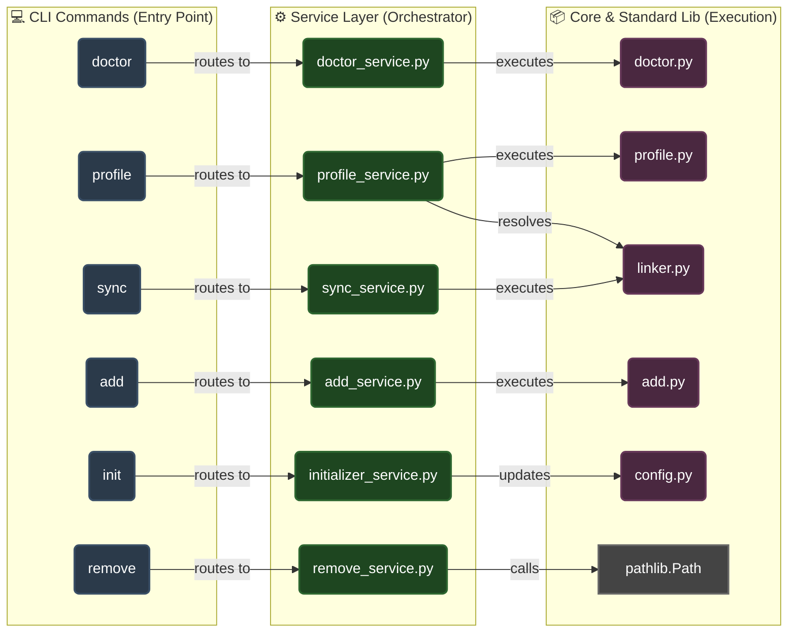
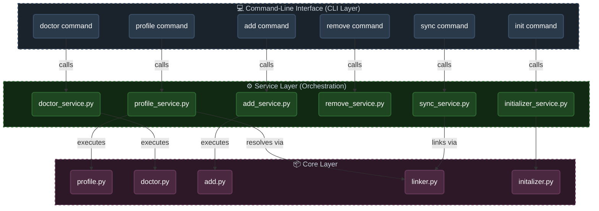

# Architecture

Dotman is divided into three layers 

- Core components:

  | File                    | Purpose                                                       |
  | ----------------------- | ------------------------------------------------------------- |
  | `linker.py`             | Linking & unlinking files                                     |
  | `add.py`                | Add files to dotfiles folder                                  |
  | `doctor.py`             | Verify symlink, dotfiles, homedir health                      |
  | `profile.py`            | Manage profiles: get, create, delete                          |
  | `get_internal_data.py`  | Get internal data (e.g. current_profile from metadata.yml)    |
  | `config.py`             | Handle configurations (dotfiles folder name, etc)             |

- Service layer: (works as a Orchestration layer)

  | File                    | Purpose                                                         |
  | ----------------------- | --------------------------------------------------------------- |
  | `profile_service.py`    | Connects CLI profile commands → core `profile.py` + `linker.py` |
  | `doctor_service.py`     | Connects CLI doctor command → core `doctor.py`                  |
  | `add_service.py`        | Connects CLI add command → core `add.py`                        |
  | `remove_service.py`     | Connects CLI remove command → standard `pathlib.Path`           |
  | `sync_service.py`       | Connects CLI sync command → core `linker.py`                    |
  | `initializer_service.py`| Connects CLI init command → core `config.py`                    |

  > This separation keeps business logic independent from CLI commands.

- Overall architecture:

    > Note:
     
    > - Config command is not shown in the diagram.
     
    > - Some basic things like calling std lib like pathlib typer and some inbuild modules like calling config is not shown in the diagram.