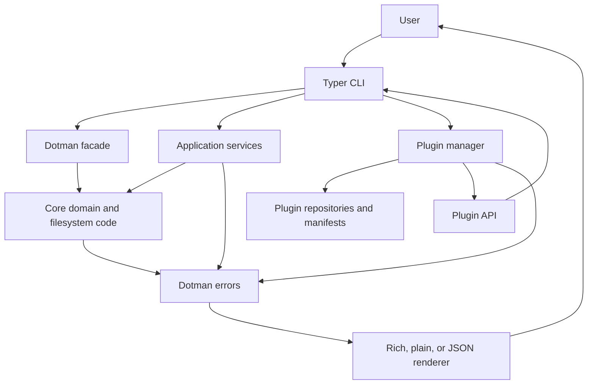
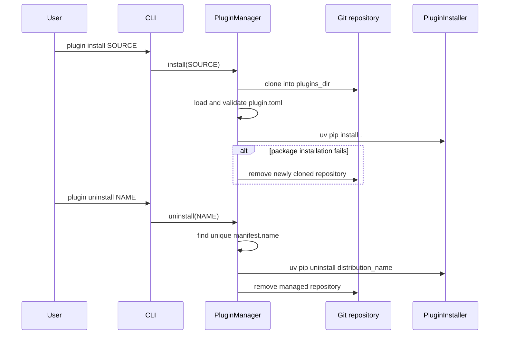

# Architecture

Dotman separates CLI concerns, workflows, filesystem/domain code, plugin loading, and error presentation. The separation is pragmatic: some commands call the public `Dotman` facade while others call an application service.



## Runtime flow

`dotman.__cli__.main()` loads the effective configuration, constructs a `PluginManager`, and loads installed plugins before Typer parses and dispatches the command. The root app owns the built-in command groups:

- file management: `init`, `add`, `remove`, `sync`, and `doctor`;
- configuration: `config show`, `config get`, and `config set`;
- profiles: `profile create`, `profile use`, `profile delete`, and `profile ls`;
- extensions: `plugin install` and `plugin uninstall`, plus plugin-provided Typer apps.

`handle_errors` converts domain-specific `DotmanError` values into the selected output format. Commands otherwise keep their own successful-output rendering.

## Dotfile model

The configured `dotfiles_dir` contains a metadata file plus profile directories. Each profile has packages, and each package preserves paths relative to `home_dir`.

```text
dotfiles_dir/
├── metadata.yml                 # active profile
└── profiles/
    └── work/
        ├── shell/.zshrc
        └── editor/.config/nvim/init.lua
```

`AddFiles` validates that an item belongs to `home_dir`, records moves in a rollback journal, and moves the item into the active profile/package. `SyncService` iterates package files and delegates to `Linker`, which either creates a symlink, repairs one, skips an already-correct link, or backs up a conflicting target. `ProfileSwitcher` unlinks the old profile before linking the requested profile.

## Main modules

| Area | Key modules | Responsibility |
| --- | --- | --- |
| CLI | `cli/app`, `cli/config`, `cli/profile`, `cli/plugin` | Typer commands, prompts, and success output. |
| Public API | `api.py` | Convenience facade for add and doctor workflows. |
| Services | `core/service` | Coordinate initialization, add, remove, sync, doctor, and profile switching. |
| Core | `core/add.py`, `core/linker.py`, `core/profile.py`, `core/doctor.py` | Dotfile model, file operations, link status, profiles, and diagnostics. |
| Configuration | `core/config` | Validated YAML configuration and filesystem constants. |
| Plugins | `plugin` | Git repositories, manifests, package installation, discovery, and command registration. |
| Errors | `errors` | Typed errors and serializable error payloads. |
| Rendering | `cli/renderer` | Rich, plain, and JSON error output. |

## Plugin lifecycle

The plugin manager owns repositories directly under `plugins_dir`.



`PluginLoader` imports the class specified by `entry_point` and invokes its `register(api)` method. `PluginAPI` deliberately exposes only Typer-app registration, keeping plugins out of Dotman's internal command wiring.

## Dependency direction

```text
CLI ──> public API / services ──> core ──> errors
CLI ──> plugin manager ──> repositories, manifests, installer, errors
CLI ──> renderers
plugins ──> PluginAPI ──> root Typer app
```

Core code does not import the CLI or render terminal output. Services do not depend on renderers. This keeps filesystem behavior testable without invoking Typer and gives callers consistent structured errors.
