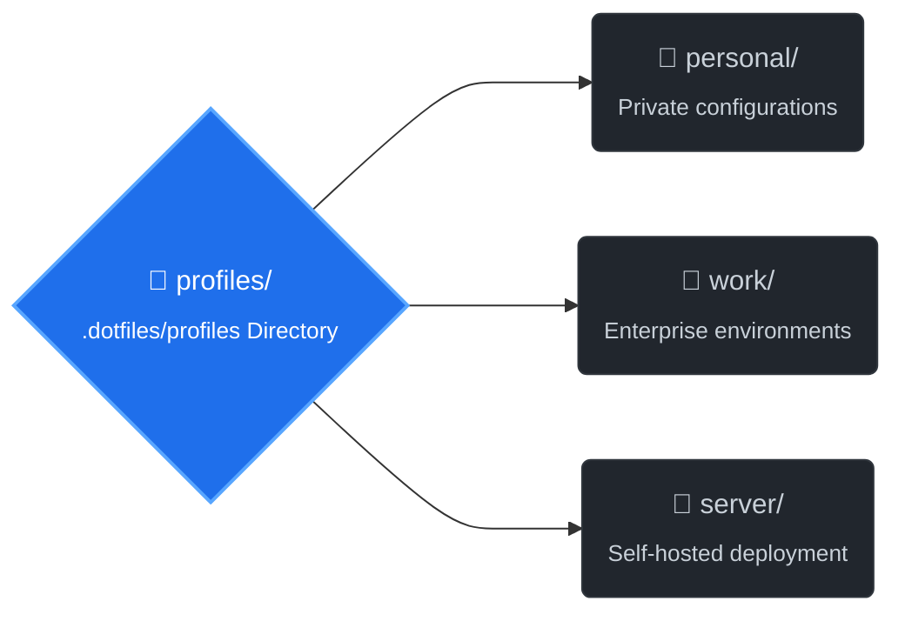

## 🏗️ Profile Structure

Below is the organizational layout of the profile handling:



> Switch between profiles seamlessly.

create a profile:

```console
$ dotman profile create personal
```

Switch between profiles seamlessly:

- Dotman automatically:
    1. Unlinks files from the active profile
    2. Updates metadata file
    3. Links files from the new profile

```console
$ dotman profile use work
Switched to profile: work

                                                                Profile Action Log (work)
┏━━━━━━━━━━━┳━━━━━━━━━━━━━━━━━━━━━━━━━━━━━━━━━━━━━━━━━━━━━━━━━━━━━━━━┳━━━━━━━━━━━━━━━━━━━━━━━━━━━━━━━━━━━━━━━━━━━━┳━━━━━━━━━━━━━━━━┳━━━━━━━━━━━━━━━━━━━━━┓
┃ Operation ┃ Source Path                                            ┃ Target Path                                ┃     Status     ┃ Details             ┃
┡━━━━━━━━━━━╇━━━━━━━━━━━━━━━━━━━━━━━━━━━━━━━━━━━━━━━━━━━━━━━━━━━━━━━━╇━━━━━━━━━━━━━━━━━━━━━━━━━━━━━━━━━━━━━━━━━━━━╇━━━━━━━━━━━━━━━━╇━━━━━━━━━━━━━━━━━━━━━┩
│ Unlink    │ /tmp/dotman-lab/dotfiles/profiles/personal/nvim/.conf… │ /tmp/dotman-lab/home/.config/nvim/init.vim │ missing_target │ Not Removed         │
│ Link      │ /private/tmp/dotman-lab/dotfiles/profiles/work/git/.g… │ /tmp/dotman-lab/home/.gitignore            │       ok       │ linked successfully │
└───────────┴────────────────────────────────────────────────────────┴────────────────────────────────────────────┴────────────────┴─────────────────────┘
```

## Features

```console
$ dotman profile --help

 Usage: dotman profile [OPTIONS] COMMAND [ARGS]...

 Manage profiles.

╭─ Options ─────────────────────────────────────────────────────────────────────────────────────────╮
│ --help          Show this message and exit.                                                       │
╰───────────────────────────────────────────────────────────────────────────────────────────────────╯
╭─ Commands ────────────────────────────────────────────────────────────────────────────────────────╮
│ use                                                                                               │
│ create  Create a new profile                                                                      │
│ delete  Delete a profile                                                                          │
│ list    List all profiles                                                                         │
╰───────────────────────────────────────────────────────────────────────────────────────────────────╯
```

### Create

```console
$ dotman profile create personal
Created profile: personal
```

### Delete

```console
$ dotman profile delete personal
Created profile: personal
```
