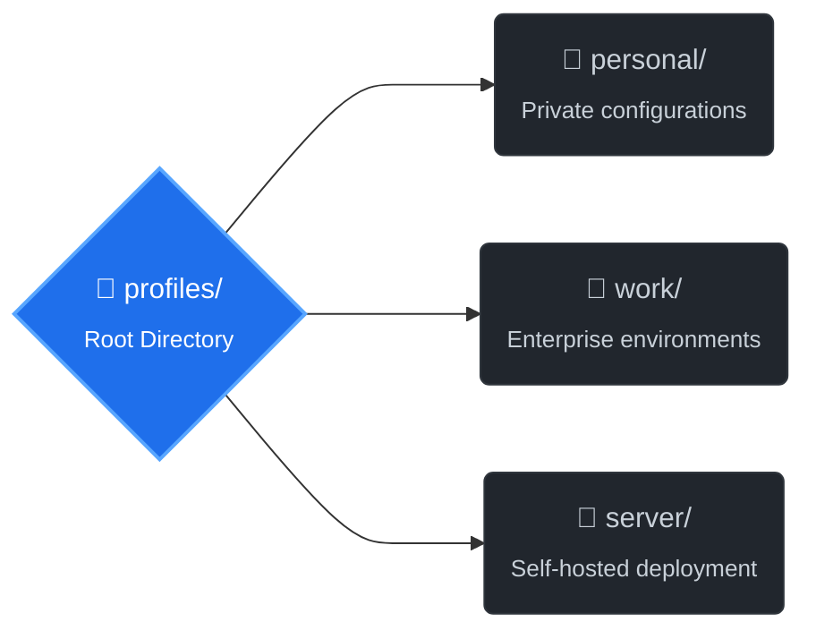

<div align="center">

# **Dotman**

```
      _       _                       
   __| | ___ | |_ _ __ ___   __ _ _ __
  / _` |/ _ \| __| '_ ` _ \ / _` | '_ \

 | (_| | (_) | |_| | | | | | (_| | | | |
  \__,_|\___/ \__|_| |_| |_|\__,_|_| |_|
```

[](https://github.com/aditya-jodha/dotman/actions/workflows/ci.yml)
[](https://codecov.io/gh/aditya-jodha/dotman)
[](./LICENSE)


<!-- uv badge is shown here becaue this tool uses uv as its installation method -->


[](https://github.com/astral-sh/uv)

[](https://discord.gg/aditya_jodha)
[](https://www.reddit.com/user/Dry_Developer)
[](https://github.com/aditya-jodha)

</div>

```
     _________________
    |                 |
    |                 |
    |                 |
    |                 |
    |                 |
 ___|             ____|___
|_________________________|
    |    _       _    |
    |   (-)     (-)   |
    \                 /
     |       ^^      |   ¨Right, let's sort your environment!¨
     \    \______/   /
      \___        __/
          \______/
```

<div align="center">

**A modern, lightweight dotfile manager written in Python.**

*Manage, organize, sync, and switch configurations seamlessly.*

</div>

______________________________________________________________________

### 🚀 Features

______________________________________________________________________

### Profile-Based Dotfile Management

Manage completely separate environments.

## 🏗️ Project Structure

Below is the organizational layout of the repository:



> Switch between profiles seamlessly.

create a profile:

```console
$ dotman profile create personal
```

Switch between profiles seamlessly:

- Dotman automatically:
  1. Unlinks files from the active profile
  1. Updates profile metadata
  1. Links files from the new profile

```console
$ dotman profile use work
Switched to profile: work

                                                                Profile Action Log (work)
┏━━━━━━━━━━━┳━━━━━━━━━━━━━━━━━━━━━━━━━━━━━━━━━━━━━━━━━━━━━━━━━━━━━━━━┳━━━━━━━━━━━━━━━━━━━━━━━━━━━━━━━━━━━━━━━━━━━━┳━━━━━━━━━━━━━━━━┳━━━━━━━━━━━━━━━━━━━━━┓
┃ Operation ┃ Source Path                                            ┃ Target Path                                ┃     Status     ┃ Details             ┃
┡━━━━━━━━━━━╇━━━━━━━━━━━━━━━━━━━━━━━━━━━━━━━━━━━━━━━━━━━━━━━━━━━━━━━━╇━━━━━━━━━━━━━━━━━━━━━━━━━━━━━━━━━━━━━━━━━━━━╇━━━━━━━━━━━━━━━━╇━━━━━━━━━━━━━━━━━━━━━┩
│ Unlink    │ /tmp/dotman-lab/dotfiles/profiles/personal/nvim/.conf… │ /tmp/dotman-lab/home/.config/nvim/init.vim │ missing_target │ Not Removed         │
│ Link      │ /private/tmp/dotman-lab/dotfiles/profiles/work/git/.g… │ /tmp/dotman-lab/home/.gitignore            │       ok       │ linked successfully │
└───────────┴────────────────────────────────────────────────────────┴────────────────────────────────────────────┴────────────────┴─────────────────────┘
```

______________________________________________________________________

### Safe File Addition

Add existing configuration files into Dotman's managed storage.

```console
$ dotman add home/.config/nvim --package nvim
Package not found created new package
File '/private/tmp/dotman-lab/home/.config/nvim' added to package 'nvim' successfully.
Please review the changes and if everything looks good then you can commit the changes.
✨  personal
┗━━ 📂 nvim
    ┗━━ 📂 .config
        ┗━━ 📂 nvim
            ┗━━ 📄 init.vim
None
Press (y) to commit the changes or (n) to restore the files: Changes committed successfully.
```

Dotman:

- Preserves directory structure
- Creates packages automatically
- Shows a preview before committing
- Allows rollback before finalizing changes

______________________________________________________________________

### Sync Command

Sync managed dotfiles back into your home directory.

```bash
dotman sync
```

Dotman automatically creates symlinks from your managed files to their correct locations.

______________________________________________________________________

### Doctor Command

Diagnose broken or incorrect symlinks.

```console
$ dotman doctor --all
                                            System Doctor Status Report
┏━━━━━━━━━━━━━━━━━━━━━━━━━━━━━━┳━━━━━━━━┳━━━━━━━━━━━━━━━━━━━━━━━━━━━━━━━━━━━━━━━━━━━━━━━━━━━━━━━━━━━━━━━━━━━━━━━━━━┓
┃ Check Name                   ┃ Status ┃ Message                                                                  ┃
┡━━━━━━━━━━━━━━━━━━━━━━━━━━━━━━╇━━━━━━━━╇━━━━━━━━━━━━━━━━━━━━━━━━━━━━━━━━━━━━━━━━━━━━━━━━━━━━━━━━━━━━━━━━━━━━━━━━━━┩
│ Dotfiles Directory           │   ok   │ Dotfiles directory '/tmp/dotman-lab/dotfiles' is valid.                  │
├──────────────────────────────┼────────┼──────────────────────────────────────────────────────────────────────────┤
│ Permissions                  │   ok   │ Permissions look fine.                                                   │
├──────────────────────────────┼────────┼──────────────────────────────────────────────────────────────────────────┤
│ Permissions                  │   ok   │ Permissions look fine.                                                   │
├──────────────────────────────┼────────┼──────────────────────────────────────────────────────────────────────────┤
│ tmux:.config/.tmux/tmux.conf │  warn  │ Missing target: '/tmp/dotman-lab/home/.config/.tmux/tmux.conf' entirely. │
├──────────────────────────────┼────────┼──────────────────────────────────────────────────────────────────────────┤
│ git:.gitignore               │   ok   │ Link OK: '/tmp/dotman-lab/home/.gitignore'.                              │
└──────────────────────────────┴────────┴──────────────────────────────────────────────────────────────────────────┘
Doctor Summary... ━━━━━━━━━━━━━━━━━━━━━━━━━━━━━━━━━━━━━━━━ 100% 0:00:00
OK: 4 | WARN: 1 | ERROR: 0
```

Checks include:

- Missing targets
- Broken symlinks
- Incorrect symlink destinations
- Non-symlink files where symlinks are expected

______________________________________________________________________

### Automatic Backups

> When conflicts occur, Dotman can safely move existing files into a backup location before linking. (This still needs to make it more robust)

______________________________________________________________________

### Tested

Current test suite includes:

- Add command tests
- Doctor tests
- Linker tests
- Unlinker tests
- Profile management tests

```bash
uv run pytest
```

Current status:

```text
146 passed in 1.39s
```

______________________________________________________________________

## Installation

### Install from **`uv`** package manager (Recommended):

- Install `uv` from [Astral Shell](https://astral.sh/uv)

  ```bash
  curl -LsSf https://astral.sh/uv/install.sh | sh
  ```

- Run Dotman instantly with **uvx** (no local install required):

  ```bash
  uvx --from git+https://github.com/aditya-jodha/dotman.git dotman --help
  ```

- If you prefer to install it globally to your environment:

  ```bash
  uv tool install git+https://github.com/aditya-jodha/dotman.git
  dotman --help
  ```

### Install from source (Traditional):

```bash
git clone https://github.com/your-username/dotman.git
cd dotman
```

Install dependencies:

```bash
uv sync
```

Run:

```bash
uv run dotman --help
```

______________________________________________________________________

## Quick Start

### Initialize Dotman

```bash
dotman init
```

### Add a Configuration

```bash
dotman add ~/.bash_profile --package bash
```

### Sync Files

```bash
dotman sync
```

### Run Diagnostics

```bash
dotman doctor
```

______________________________________________________________________

## How dotman Works

- Dotman uses a simple directory structure to manage dotfiles.

- And make symlink on the spot while seeing the directory structure.

  ```text
  dotfiles/
  ├── metadata.yml
  └── profiles
      ├── personal
      │   ├── git
      │   │   └── .gitconfig
      │   └── nvim
      │       └── .config
      │           └── nvim
      │               └── init.vim
      │               └── plug.vim
      │
      └── work
          ├── bash
          │   └── .bash_profile
          └── tmux
              └── .tmux.conf
  ```

______________________________________________________________________

## Example Workflow

Create a profile:

```bash
dotman profile create work
```

Switch to it:

```bash
dotman profile use work
```

Add files:

```bash
dotman add ~/.bash_profile --package bash
dotman add ~/.config/.tmux --package tmux
```

Sync:

```bash
dotman sync
```

Verify:

```bash
dotman doctor
```

______________________________________________________________________

## Commands

| Command | Description |
| ----------------------- | ----------------------- |
| `dotman init` | Initialize Dotman |
| `dotman add` | Add a file or directory |
| `dotman sync` | Create symlinks |
| `dotman doctor` | Verify symlink health |
| `dotman profile create` | Create profile |
| `dotman profile use` | Switch profile |
| `dotman profile delete` | Delete profile |
| `dotman profile list` | List profiles |

______________________________________________________________________

## Architecture

- Core components:

  | File | Purpose |
  | --- | --- |
  | `linker.py` | Linking & unlinking files |
  | `add.py` | Add files to dotfiles folder |
  | `doctor.py` | Verify symlink, dotfiles, homedir health |
  | `profile.py` | Manage profiles: get, create, delete |
  | `get_internal_data.py` | Get internal data (e.g. current_profile from metadata.yml) |
  | `config.py` | Handle configurations (dotfiles folder name, etc) |

  ```mermaid
  flowchart TB
      core --> `linker.py`[linker.py <br> Linking & unlinking files]
      core --> add.py[add.py <br> Add files to dotfiles folder]
      core --> doctor.py[doctor.py <br> Verify symlink, dotfiles, homedir health]
      core --> profile.py[profile.py <br> Manage profiles: get, create, delete]
      core --> get_internal_data.py[get_internal_data.py <br> Get internal data from metadata.yml]
      core --> config.py[config.py <br> Handle configurations: dotfiles folder name, etc]
  ```

- Service layer: (works as a Orchestration layer)

  | File | Purpose |
  | --- | --- |
  | `profile_service.py` | Connects CLI profile commands → core `profile.py` + `linker.py` |
  | `doctor_service.py` | Connects CLI doctor command → core `doctor.py` |
  | `add_service.py` | Connects CLI add command → core `add.py` |
  | `sync_service.py` | Connects CLI sync command → core `linker.py` |
  | `initializer_service.py` | Connects CLI init command → core `config.py` |

  ```mermaid
  flowchart LR
      service --> CLI_app_Doctor  --> doctor_service.py  --> doctor.py
      service --> CLI_app_Profile --> profile_service.py --> profile.py & linker.py
      service --> CLI_app_Add     --> add_service.py     --> add.py
      service --> CLI_app_Sync    --> sync_service.py    --> linker.py
      service --> CLI_app_Init    --> initializer_service.py --> config.py
  ```

  > This separation keeps business logic independent from CLI commands.

- Overall architecture:

  ```mermaid
  flowchart TB
      %% Top-level blocks
      subgraph CLI["Command-Line Interface (CLI Layer)"]
          CLI_Profile[profile command]
          CLI_Doctor[doctor command]
          CLI_Add[add command]
          CLI_Sync[sync command]
          CLI_Init[init command]
      end

      subgraph Services["Service Layer (Orchestration)"]
          profile_service[profile_service.py]
          doctor_service[doctor_service.py]
          add_service[add_service.py]
          sync_service[sync_service.py]
          init_service[initializer_service.py]
      end

      subgraph Core["Core Layer"]
          profile_core[profile.py]
          doctor_core[doctor.py]
          add_core[add.py]
          linker_core[linker.py]
          config_core[config.py]
      end

      %% Connections
      CLI_Profile --> profile_service --> profile_core
      profile_service --> linker_core

      CLI_Doctor --> doctor_service --> doctor_core

      CLI_Add --> add_service --> add_core

      CLI_Sync --> sync_service --> linker_core

      CLI_Init --> init_service --> config_core

  ```

  > Note: config command is not shown in the diagram.

## How to change the dotfiles folder name

______________________________________________________________________

User can change the dotfiles folder name by editing the `config.py` file or leave this task to dotman.

```console
$ dotman config
dotfiles_dir: /tmp/dotman-lab/dotfiles
home_dir: /tmp/dotman-lab/home

You can change your config file path via `CONFIG_ENV_VAR environment` variable. Default is `~/.config/dotman/config.yml`

$ dotman config set dotfiles_dir my_fav_name
You can change your config file path via `CONFIG_ENV_VAR environment` variable. Default is `~/.config/dotman/config.yml`
Updated dotfiles_dir to my_fav_name

$ dotman config
dotfiles_dir: my_fav_name
home_dir: /tmp/dotman-lab/home

You can change your config file path via `CONFIG_ENV_VAR environment` variable. Default is `~/.config/dotman/config.yml`
```

> Note: Assuming that user gave the absolute path of the dotfiles folder.

## Roadmap

### Completed

- [x] Dotfile management
- [x] Package support
- [x] Sync command
- [x] Doctor command
- [x] Profile management
- [x] Profile switching
- [x] Automated testing

### Planned

- [ ] Profile export/import
- [ ] Configuration file support
- [ ] Windows support
- [ ] Package removal command
- [ ] Dry-run mode improvements

______________________________________________________________________

## Why I Built Dotman

Dotman started as a learning project.

The goal was not just to create another dotfile manager, but to understand how real command-line applications are designed:

- filesystem operations
- symlink management
- testing
- service architecture
- error handling
- CLI design

Over time it evolved into a fully tested tool capable of managing multiple environments safely.

<div>
    <div align="Right">
    𝕯𝖔𝖙𝖒𝖆𝖓
    </div>
    <div align="center">
    
    </div>
</div>
