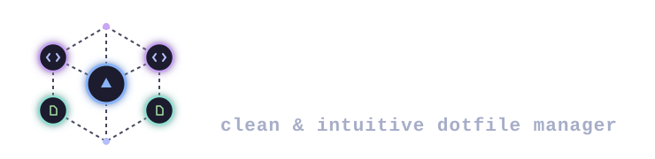
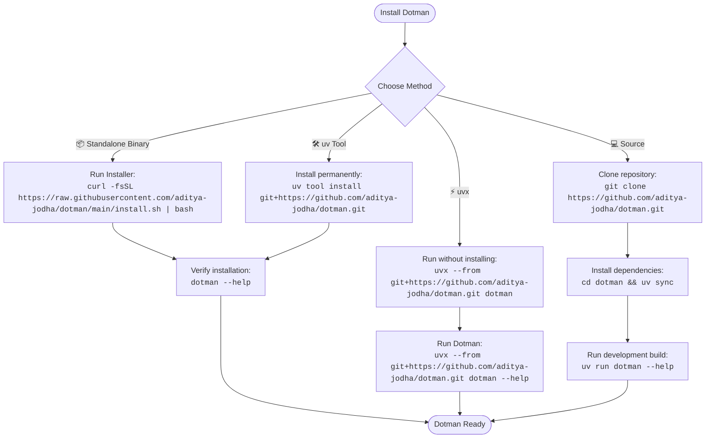

<div align="center">

# Dotman

Dotman is a Python CLI for storing dotfiles by profile and package, then linking them back into a home directory. It also provides profile switching, diagnostics, structured error output, and installable command plugins.

</div>

[GitHub](https://github.com/user-attachments/assets/e07f0579-8d2d-42e5-bc16-0a537472da9c)

<div align="center">

[](https://codecov.io/gh/aditya-jodha/dotman)
[](./LICENSE)
[](https://www.python.org/downloads/release/python-3120/)

<!-- uv badge is shown here becaue this tool uses uv as its installation method -->


[](https://github.com/astral-sh/uv)

[](https://github.com/aditya-jodha)

[](https://github.com/aditya-jodha/dotman/actions/workflows/test.yml)
[](https://github.com/aditya-jodha/dotman/actions/workflows/release.yml)
[](https://github.com/aditya-jodha/dotman/actions/workflows/stale.yml)
[](https://github.com/aditya-jodha/dotman/actions/workflows/lint.yml)
[](https://github.com/aditya-jodha/dotman/actions/workflows/markdownlint.yml)
[](https://github.com/aditya-jodha/dotman/actions/workflows/docker-publish.yml)

</div>

## ✨ Features

- **Plugin System**: Extend Dotman with custom commands and functionality.
- **Multiple Profiles**: Manage separate configurations seamlessly.
- **Automatic Symlink Management**: Handles path linking without manual intervention.
- **Safe Rollback**: Revert changes safely if things go wrong.
- **Package Organization**: Keep everything structured and neat.
- **Doctor Diagnostics**: Instantly troubleshoot environmental errors.
- **Rich CLI Output**: Beautiful, readable terminal interfaces.
- **JSON Output for Automation**: Parse and pipe data into other scripts effortlessly.
- **Strongly Typed Configuration**: Validated out-of-the-box via Pydantic models.

---

🧪 **230+ Tests Passing**

---

## Installation

<table>
  <tr>
    <!-- Card 1: Points to the ### Binary Installation heading -->
    <td align="center" width="25%">
      <a href="#binary-installation" style="text-decoration: none; color: inherit;">
        <h3>📦 Binary</h3>
        <p>The easiest way to install.</p>
      </a>
    </td>
    <!-- Card 2: Points to the ### Install via uv Tool heading -->
    <td align="center" width="25%">
      <a href="#install-via-uv-tool" style="text-decoration: none; color: inherit;">
        <h3>🛠️ uv Tool</h3>
        <p>Install permanently using uv.</p>
      </a>
    </td>
    <!-- Card 3: Points to the ### Run with uvx heading -->
    <td align="center" width="25%">
      <a href="#run-with-uvx" style="text-decoration: none; color: inherit;">
        <h3>⚡ uvx</h3>
        <p>Run without installing.</p>
      </a>
    </td>
    <!-- Card 4: Points to the ### Build from Source heading -->
    <td align="center" width="25%">
      <a href="#build-from-source" style="text-decoration: none; color: inherit;">
        <h3>💻 Source</h3>
        <p>For development.</p>
      </a>
    </td>
  </tr>
</table>



### Binary installation

The easiest way to install Dotman is via the official installation script. It automatically downloads the pre-built binary for your specific operating system and architecture, placing it in your user's local bin directory.

```bash
curl -fsSL https://raw.githubusercontent.com/aditya-jodha/dotman/main/install.sh | bash
```

Then verify the installation:

```bash
dotman --help
```

### Install via uv Tool

Dotman requires Python 3.12.13 or later. If you use [uv](https://docs.astral.sh/uv/) for Python package management, you can install Dotman globally on your system:

```bash
uv tool install git+https://github.com/aditya-jodha/dotman.git
dotman --help
```

### Run with uvx

If you prefer not to install anything permanently, you can execute Dotman on the fly directly from the repository using `uvx`:

```bash
uvx --from git+https://github.com/aditya-jodha/dotman.git dotman --help
```

### Build from Source

If you want to contribute to the project or work from the latest local codebase, you can build and run Dotman directly from the source:

```bash
git clone https://github.com/aditya-jodha/dotman.git
cd dotman
uv sync
uv run dotman --help
```

---

## Quick start

Initialize Dotman and choose the first profile when prompted:

```bash
dotman init
```

Add a file from the configured home directory to a package. Dotman previews the operation and asks whether to commit it.

```bash
dotman add ~/.zshrc --package shell
dotman sync
```

The managed copy is stored under:

```text
~/.dotfiles/
├── metadata.yml
└── profiles/
    └── <profile>/
        └── <package>/
            └── <path-relative-to-home>
```

For example, adding `~/.config/nvim/init.lua` to the `editor` package creates `~/.dotfiles/profiles/<profile>/editor/.config/nvim/init.lua`. `dotman sync` then links that file to `~/.config/nvim/init.lua`.

## Commands

| Command | Description |
| --- | --- |
| `dotman init` | Create the dotfiles directory and initial profile. An existing directory is renamed to `<dotfiles_dir>.backup`. |
| `dotman add FILE --package NAME` | Move a file or directory from the configured home directory into the active profile; confirm to commit or roll back. |
| `dotman remove FILE` | Remove a managed file from the active profile and clean up empty package directories. |
| `dotman sync [--package NAME] [--dry-run]` | Create, repair, or preview symlinks for the active profile. Existing conflicting targets are backed up under `~/.dotman_backup`. |
| `dotman doctor [-a\|--all]` | Report dotfiles-directory, package, permission, and symlink health. `--all` includes healthy links. |
| `dotman profile create NAME` | Create an empty profile. |
| `dotman profile use [NAME]` | Switch profiles, unlinking the old profile and linking the new one. Without a name, it lists profiles. |
| `dotman profile delete NAME` | Delete an empty profile. |
| `dotman profile ls` | List profiles. |
| `dotman config show` | Print the effective configuration. |
| `dotman config get KEY` | Print one configuration value. |
| `dotman config set KEY VALUE` | Validate and persist one configuration value. |
| `dotman plugin install SOURCE` | Clone a Git plugin repository, install its Python package, and validate its `dotman.plugins` entry point. |
| `dotman plugin uninstall NAME` | Uninstall a plugin by its `dotman.plugins` entry-point name and remove its managed repository. |

Use `--output rich`, `--output plain`, or `--output json` for supported structured-error renderers.

## Configuration

The default configuration file is `~/.config/dotman/config.yml`. Set `DOTMAN_CONFIG` to use another location. Its supported keys are:

```yaml
dotfiles_dir: ~/.dotfiles
home_dir: ~
plugins_dir: ~/.config/dotman/plugins
```

Paths are expanded when Dotman loads the configuration. Existing configuration files that do not contain `plugins_dir` continue to use the default location.

## Plugins

A plugin is a Git/Local repository containing an installable Python project. On startup, Dotman discovers installed packages that expose a `dotman.plugins` entry point, then allows them to register custom Typer sub-applications and add validators through `PluginAPI`.

- Plugin identity, version, description, and distribution name come from `pyproject.toml`; no separate `plugin.toml` is required. Each entry-point plugin class must declare `api_version = "1"`.

```text
fake_repo on  main [!] is 📦 v0.1.0 via 🐍 v3.12.13 
❯ tree                                                                      
 .
├── pyproject.toml
├── README.md
├── src
│   └── fake_repo
│       ├── __init__.py
│       └── plugin.py
└── uv.lock
```

- Define the entry point in `pyproject.toml`. The entry point must point to a class exposing a `register(api: PluginAPI)` method. Use `api.add_typer()` to attach your custom CLI commands and `api.add_validator()` for add validation.

```toml title="pyproject.toml"
[project]
name = "dotman-example-plugin"
version = "0.1.0"
description = "Adds example commands to Dotman"

[project.entry-points."dotman.plugins"]
example-plugin = "fake_repo.plugin:ExamplePlugin"
```

```python
import typer

from dotman.plugin import PluginAPI, AddValidationContext
from errors import DotmanError

app = typer.Typer(help="Example plugin commands.")


@app.command()
def hello(name: str = "world") -> None:
    print(f"Hello, {name}!")


def validate_example(cxt: AddValidationContext) -> None:
    if cxt.package != "example":
        raise DotmanError("Invalid package name for example plugin.")


class ExamplePlugin:
    api_version = "1"

    def register(self, api: PluginAPI) -> None:
        api.add_typer(app, name="example")
        api.add_validator(validate_example)
```

> [!TIP]
> Plugins can be managed directly through the core Dotman CLI using Git repository URLs:

```bash
dotman plugin install https://github.com/example/dotman-example-plugin.git
dotman plugin uninstall example-plugin
```

> [!CAUTION]
> If installation fails after cloning, Dotman removes the newly cloned repository. A plugin that fails to load or declares an incompatible API version is skipped so that Dotman can still start. During uninstallation Dotman removes the Python distribution, then deletes only the matching repository directly inside `plugins_dir`.

## Development

```bash
uv run pytest
uv run ruff check src tests
uv run ruff format --check src tests
```

## Roadmap

### Completed

- [x] Dotfile management
- [x] Sync command
- [x] Doctor command
- [x] Profile management
- [x] Profile switching
- [x] Automated testing
- [x] Package removal command
- [x] Configuration file support
- [x] Plugin system

### Planned

- [ ] Plugin discovery and search (~ PLUGIN MARKETPLACE)
- [ ] Package management
- [ ] Profile export/import
- [ ] Dry-run mode improvements
- [ ] Windows support

See [CONTRIBUTING.md](CONTRIBUTING.md) for contribution guidance and [ARCHITECTURE.md](ARCHITECTURE.md) for module boundaries and runtime flow.

<div>
    <div align="Right">
    𝕯𝖔𝖙𝖒𝖆𝖓
    </div>
    <div align="center">
    
    </div>
</div>
